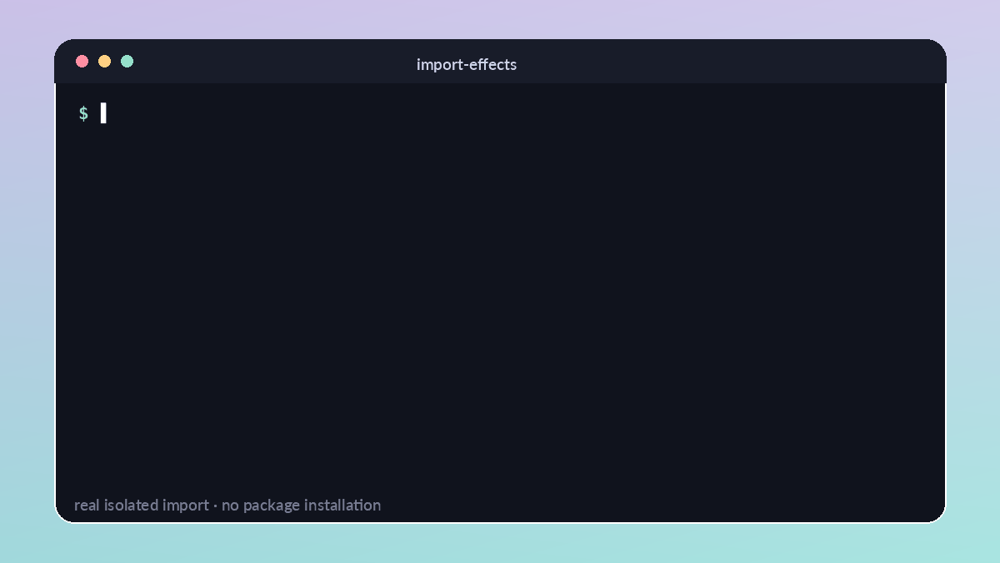

# import-effects

> See what Python does when you `import`.

[](https://pypi.org/project/import-effects/) [](https://pypi.org/project/import-effects/) [](https://github.com/royalpinto007/import-effects/actions/workflows/ci.yml) [](LICENSE)

`import-effects` runs one import in a fresh child interpreter and reports file writes, sockets, subprocesses, threads, environment changes, and other observable import-time behavior.

```bash
pip install import-effects
import-effects requests
```



## 30-second quickstart

```console
$ import-effects mypackage
import mypackage

✓ imported in 143 ms

SIDE EFFECTS

⚠ FILE WRITE
  /home/me/.cache/mypackage/config.json

⚠ NETWORK
  api.example.com:443

⚠ THREAD
  background-worker

3 side effects detected · 1 file-write · 1 network · 1 thread
```

The target must already be importable. `import-effects` never installs it and normal inspection needs no server, database, Docker, network access, or elevated privileges.

## CLI

```bash
import-effects package.submodule
import-effects requests --json
import-effects requests --quiet
import-effects requests --verbose
import-effects requests --timeout 10
import-effects requests --fail-on network,subprocess,file-write
import-effects requests --ignore '~/.cache/**'
```

`--fail-on` turns selected observations into policy failures without pretending every observation is inherently unsafe. `--ignore` matches the human-readable effect detail and may be repeated.

Exit codes:

| Code | Meaning                                           |
| ---: | ------------------------------------------------- |
|    0 | Import succeeded with no configured violation    |
|    1 | A configured `--fail-on` effect was detected     |
|    2 | Invalid CLI input                                |
|    3 | Target import failed or timed out                |
|    4 | Internal inspector failure                       |

## Python API

```python
from import_effects import inspect_import

report = inspect_import("mypackage", timeout=10)

print(report.duration_ms)
for effect in report.effects:
    print(effect.kind, effect.detail, effect.confidence)
```

For tests:

```python
from import_effects import assert_no_effects


def test_import_stays_quiet() -> None:
    assert_no_effects("mypackage", forbidden=("network", "subprocess", "file-write"))
```

The models are frozen, typed dataclasses. Reports can be converted with `report.to_dict()` and filtered with `report.effects_of("network")`.

## What it observes

- files opened for writing, removal, rename, and directory operations
- socket connect, bind, and DNS activity
- subprocess spawning, `os.system`, and process forks
- Python threads and `multiprocessing` children started
- environment variable names added, removed, or changed, never their values
- current directory, logging handlers, `sys.path`, warning filters, and signal handlers
- newly imported module names, import duration, stdout/stderr, failures, crashes, and timeouts

CPython audit events provide high-confidence observations for many OS operations. Before/after snapshots and lifecycle wrappers cover state changes and thread/process starts. Each effect includes confidence and attribution metadata because an effect may come from the target, one of its dependencies, or code merely observed during the import window.

See [Architecture and limitations](docs/architecture.md) and the [API reference](docs/api.md).

## Security warning

**Importing untrusted Python code executes that code. `import-effects` is an observer, not a sandbox.**

The target runs in a separate child interpreter, so it cannot directly mutate the parent Python process. It still runs as your user with normal filesystem, network, and process permissions. Use an OS sandbox or disposable virtual machine when inspecting code you do not trust.

Target stdout and stderr are capped. Suspected credentials in captured messages are redacted, and environment variable values are never included. Audit hooks are visibility mechanisms, not a security boundary, and sufficiently hostile native code can evade or disable Python-level observation.

## Platform support

`import-effects` targets CPython 3.10 through 3.14 on Linux, macOS, and Windows. Audit event availability and process termination behavior differ by Python and OS. Linux currently provides the broadest coverage. Windows does not offer the same process-group cleanup guarantees as POSIX, and some native extensions perform operations below CPython's audit surface.

## Development

```bash
python -m venv .venv
. .venv/bin/activate
pip install -e '.[dev]'
ruff format --check .
ruff check .
mypy
pytest --cov
python -m build
twine check dist/*
```

See [Contributing](CONTRIBUTING.md), [Security](SECURITY.md), and the [Changelog](CHANGELOG.md).

## License

MIT

